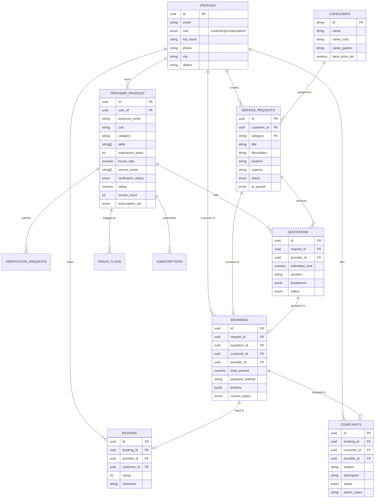

# Database Entity-Relationship (ER) Diagram
**KaamSaathi Relational Database Model & PostgreSQL Schema**

---

```mermaid
erDiagram
    PROFILES ||--o{ PROVIDER_PROFILES : "owns"
    PROFILES ||--o{ SERVICE_REQUESTS : "creates"
    PROFILES ||--o{ BOOKINGS : "customer in"
    PROFILES ||--o{ REVIEWS : "writes"
    PROFILES ||--o{ COMPLAINTS : "files"
    
    PROVIDER_PROFILES ||--o{ VERIFICATION_REQUESTS : "submits"
    PROVIDER_PROFILES ||--o{ QUOTATIONS : "bids"
    PROVIDER_PROFILES ||--o{ FRAUD_FLAGS : "flagged by"
    PROVIDER_PROFILES ||--o{ SUBSCRIPTIONS : "subscribes"
    
    CATEGORIES ||--o{ SERVICE_REQUESTS : "categorizes"
    
    SERVICE_REQUESTS ||--o{ QUOTATIONS : "receives"
    SERVICE_REQUESTS ||--o| BOOKINGS : "converts to"
    
    QUOTATIONS ||--o| BOOKINGS : "accepted in"
    
    BOOKINGS ||--o| REVIEWS : "rated in"
    BOOKINGS ||--o{ COMPLAINTS : "disputed in"

    PROFILES {
        uuid id PK
        string email
        enum role "customer|provider|admin"
        string full_name
        string phone
        string city
        string district
    }

    PROVIDER_PROFILES {
        uuid id PK
        uuid user_id FK
        string business_name
        string cnic
        string category
        string[] skills
        int experience_years
        numeric hourly_rate
        string[] service_areas
        enum verification_status
        numeric rating
        int review_count
        enum subscription_tier
    }

    CATEGORIES {
        string id PK
        string name
        string name_urdu
        string name_pashto
        numeric base_price_pkr
    }

    SERVICE_REQUESTS {
        uuid id PK
        uuid customer_id FK
        string category FK
        string title
        string description
        string location
        string urgency
        enum status
        jsonb ai_parsed
    }

    QUOTATIONS {
        uuid id PK
        uuid request_id FK
        uuid provider_id FK
        numeric estimated_cost
        string duration
        jsonb breakdown
        enum status
    }

    BOOKINGS {
        uuid id PK
        uuid request_id FK
        uuid quotation_id FK
        uuid customer_id FK
        uuid provider_id FK
        numeric total_amount
        string payment_method
        jsonb timeline
        enum current_status
    }

    REVIEWS {
        uuid id PK
        uuid booking_id FK
        uuid provider_id FK
        uuid customer_id FK
        int rating
        string comment
    }

    COMPLAINTS {
        uuid id PK
        uuid booking_id FK
        uuid customer_id FK
        uuid provider_id FK
        string subject
        string description
        enum status
        string admin_notes
    }
```
